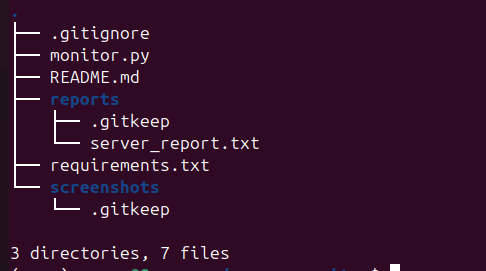
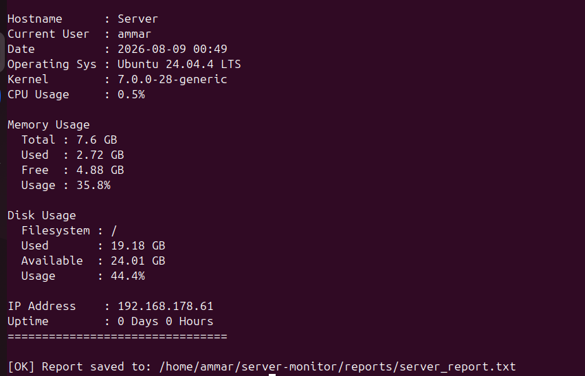
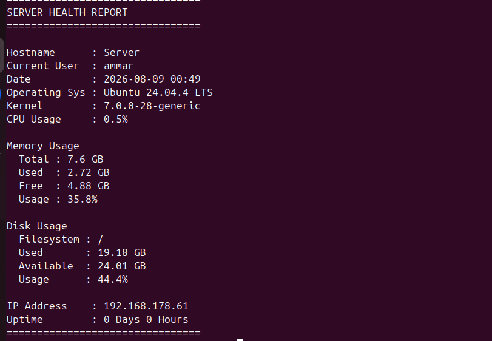
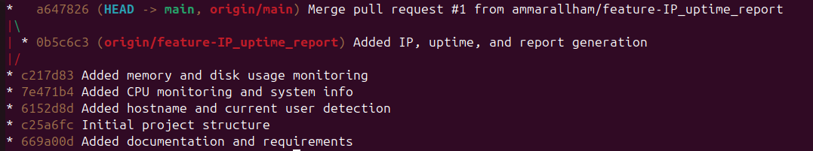
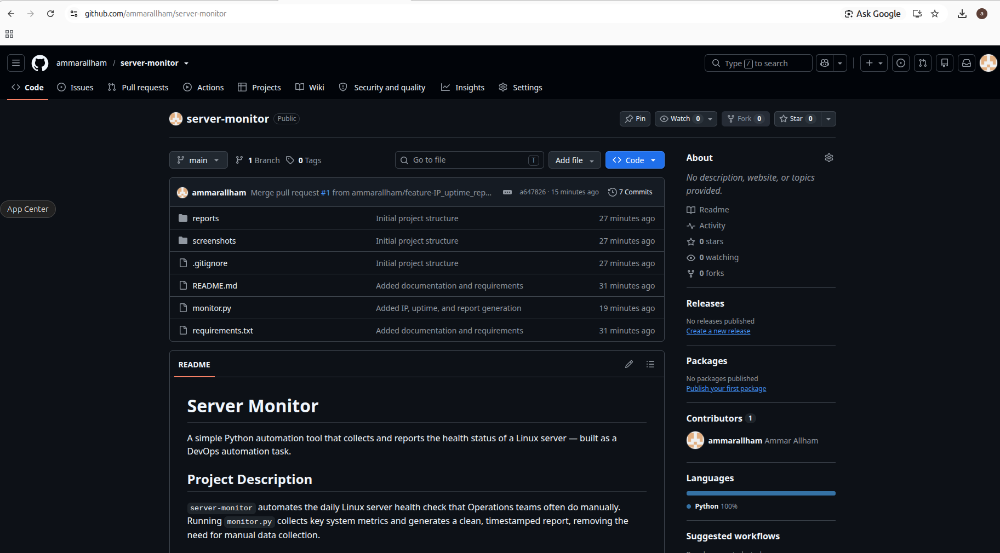

# Server Monitor

A simple Python automation tool that collects and reports the health status
of a Linux server — built as a DevOps automation task.

## Project Description

`server-monitor` automates the daily Linux server health check that
Operations teams often do manually. Running `monitor.py` collects key
system metrics and generates a clean, timestamped report, removing the
need for manual data collection.

## Features

- Hostname detection
- Current logged-in user
- Current date & time
- Operating system and kernel version
- CPU usage percentage
- Memory usage (total / used / free / percentage)
- Disk usage (filesystem / used / available / percentage)
- Primary IPv4 address
- System uptime (days & hours)
- Automatic report generation to `reports/server_report.txt`

## Technologies Used

- Python 3
- [`psutil`](https://pypi.org/project/psutil/) — system and process utilities
- Linux (Ubuntu) command line
- Git & GitHub

## Project Structure

```
server-monitor/
│
├── monitor.py          # Main automation script
├── reports/             # Generated health reports
│   └── server_report.txt
├── screenshots/         # Screenshots for documentation/submission
├── README.md
├── .gitignore
└── requirements.txt
```

## Installation

1. Clone the repository:
   ```bash
   git clone <your-repo-url>
   cd server-monitor
   ```

2. Create and activate a virtual environment:
   ```bash
   python3 -m venv venv
   source venv/bin/activate
   ```

3. Install dependencies:
   ```bash
   pip install -r requirements.txt
   ```

## How to Run

```bash
python3 monitor.py
```

The script prints the report to the console and saves it to
`reports/server_report.txt`.

## Sample Output

```
================================
SERVER HEALTH REPORT
================================

Hostname      : devops-server
Current User  : ammar-allham
Date          : 2026-08-07 14:30
Operating Sys : Ubuntu 24.04.4 LTS
Kernel        : 6.8.0
CPU Usage     : 15%

Memory Usage
  Total : 16.0 GB
  Used  : 6.0 GB
  Free  : 10.0 GB
  Usage : 37%

Disk Usage
  Filesystem : /
  Used       : 40.0 GB
  Available  : 110.0 GB
  Usage      : 27%

IP Address    : 192.168.1.20
Uptime        : 3 Days 5 Hours
================================
```

## Screenshots

### 1. Project Structure


### 2. Running the Python Script


### 3. Generated Report


### 4. Git Commit History


### 5. GitHub Repository


## Author

Eng. Ammar Allham
